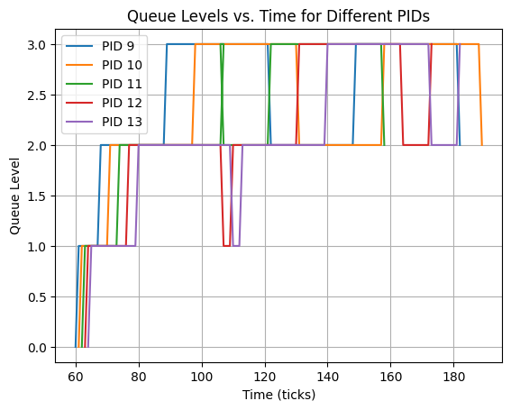

# Intro to Xv6
OSN Monsoon 2023 mini project 2

## Some pointers
- main xv6 source code is present inside `initial_xv6/src` directory. This is where you will be making all the additions/modifications necessary for the first 3 specifications. 
- work inside the `networks/` directory for the Specification 4 as mentioned in the assignment.
- Instructions to test the xv6 implementations are given in the `initial_xv6/README.md` file. 

- You are free to delete these instructions and add your report before submitting. 

# Report

## FCFS

- We select the process with the lowest creation time and run it until it is over.
- We then select the next process with the lowest creation time and so on...

## MLFQ

- There are 4 queues (0, 1, 2, 3). 0 has the highest priority and 4 has the lowest priority.
- The time slices are 1, 3, 9, 15 respectively.
- If a process exceeds this timeslice, it is pushed lower in priority.
- Otherwise it stays in the same priority level. Processes may take advantage of this and eat up the CPUs resources by terminating its processes at given intervals of time.
- If a process waits for a long period in time (agelimit), it is pushed higher in priority.

## Performace Report

- Default : Average run-time 15,  wait-time 162
- FCFS : Average run-time 15,  wait-time 130
- MLFQ : Average run-time 14,  wait-time 151

- We can infer that the average run time was the least for MLFQ and average wait time as the maximum for Round-Robin

### MLFQ Scheduling Analysis
- Aging time = 30 ticks
- CPUs = 1

# Report For Networking

## Implementation of data sequencing and retransmission

- TCP has a 3-way handshake (SYN, SYN+ACK, ACK). We have implemented only ACK. We haven't used the SYN bit at all.
- In our ACK implementation, we are sending the acknowledgement after every chunk of code. But in TCP, it is sent after every couple of chunks of data that it recieves.
- TCP uses an end-to-end flow control protocol to avoid having the sender send data too fast for the TCP receiver to receive and process it reliably. We haven't employed this in our implementation.
- In TCP, client and server can communicate with each other concurrently, ie. while server is sending client a message, client can also send server a messsage.
- In our implementation, client and server can communicate with each other but in a sequential manner, ie. one after the other (like a walkie-talkie).
- We haven't used any flags like FYN, RST to terminate the protocol.

## Extension to incorporate Flow Control

### What is Flow Control?

- TCP uses an end-to-end flow control protocol to avoid having the sender send data too fast for the TCP receiver to receive and process it reliably. Having a mechanism for flow control is essential in an environment where machines of diverse network speeds communicate. For example, if a PC sends data to a smartphone that is slowly processing received data, the smartphone must be able to regulate the data flow so as not to be overwhelmed.

- TCP uses a sliding window flow control protocol. In each TCP segment, the receiver specifies in the receive window field the amount of additionally received data (in bytes) that it is willing to buffer for the connection. The sending host can send only up to that amount of data before it must wait for an acknowledgement and receive window update from the receiving host. 

### Implementation

- According to me there are 2 ways to implement this.

- Initially the client can send some chunk of data to the server. After the server recieves the data, it can compare it with some threshold that it maintains (max data it can recieve in one go). If the data it has recieved is more than this, then it will tell the client to reduce its window size. If not, it can tell the client to increase it.

- The client could also keep tab on the time elapsed between sending a chunk of data to the server and recieving acknowledgment from it. Based on some threshold again, it can decide whether to increase or decrease the window size.

